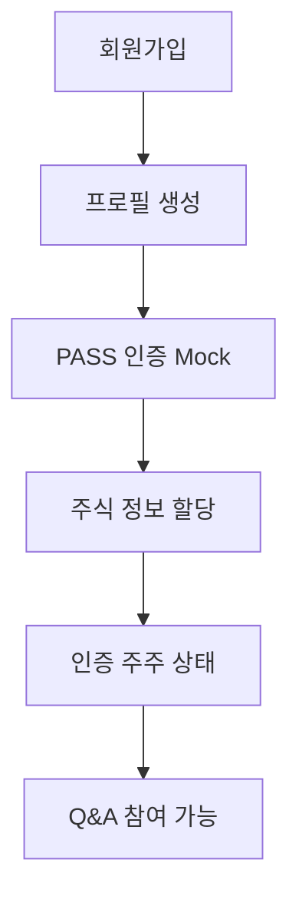
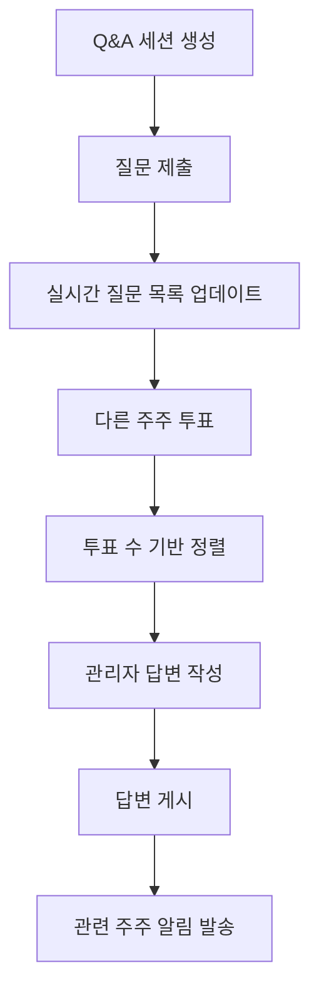
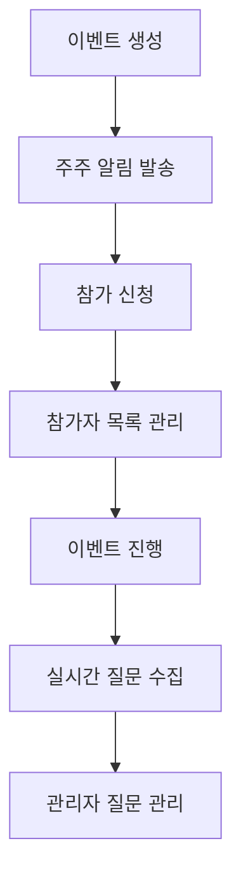

# IR-CSaaS MVP 설계 문서

## 개요

본 문서는 IR-CSaaS MVP의 백엔드 중심 시스템 설계를 정의합니다. Java Spring Boot를 백엔드로, Supabase를 데이터베이스 및 인프라로 활용하여 빠른 MVP 개발과 확장 가능한 아키텍처를 구현합니다.

## 아키텍처

### 전체 시스템 아키텍처

```
┌─────────────────┐    ┌──────────────────┐    ┌─────────────────┐
│   Next.js App   │────│  Spring Boot API │────│    Supabase     │
│   (Frontend)    │    │   (Backend)      │    │   (Database)    │
└─────────────────┘    └──────────────────┘    └─────────────────┘
         │                       │                       │
         │              ┌────────┴────────┐             │
         │              │                 │             │
         │              ▼                 ▼             │
         │    ┌─────────────────┐ ┌─────────────────┐   │
         │    │  Spring Security│ │   Supabase      │   │
         │    │   JWT Auth      │ │   Real-time     │   │
         │    └─────────────────┘ └─────────────────┘   │
         │                                              │
         └──────────────────────────────────────────────┘
```

### 기술 스택

**Frontend:**
- Next.js 15 (App Router)
- TypeScript
- Tailwind CSS
- React Query (데이터 페칭)

**Backend:**
- Java 17
- Spring Boot 3.2
- Spring Security 6
- Supabase Java Client
- Supabase PostgreSQL (데이터베이스)
- Supabase Real-time (실시간 통신)

**인증:**
- Spring Security + Supabase Auth
- JWT 토큰
- Mock PASS 인증

## 컴포넌트 및 인터페이스

### 1. 데이터베이스 스키마

#### 1.1 사용자 관리 테이블

```sql
-- 사용자 프로필 (Supabase Auth 확장)
CREATE TABLE public.profiles (
  id UUID REFERENCES auth.users(id) PRIMARY KEY,
  email TEXT UNIQUE NOT NULL,
  name TEXT NOT NULL,
  phone TEXT,
  is_verified BOOLEAN DEFAULT FALSE,
  pass_verified_at TIMESTAMP WITH TIME ZONE,
  created_at TIMESTAMP WITH TIME ZONE DEFAULT NOW(),
  updated_at TIMESTAMP WITH TIME ZONE DEFAULT NOW()
);

-- RLS 정책 설정
ALTER TABLE public.profiles ENABLE ROW LEVEL SECURITY;
CREATE POLICY "Users can view own profile" ON public.profiles
  FOR SELECT USING (auth.uid() = id);
CREATE POLICY "Users can update own profile" ON public.profiles
  FOR UPDATE USING (auth.uid() = id);

-- 주식 보유 정보 (Mock 데이터)
CREATE TABLE public.user_stocks (
  id UUID DEFAULT gen_random_uuid() PRIMARY KEY,
  user_id UUID REFERENCES public.profiles(id) ON DELETE CASCADE,
  company_code TEXT NOT NULL, -- 기업 코드 (예: 005930)
  company_name TEXT NOT NULL, -- 기업명 (예: 삼성전자)
  shares_owned INTEGER NOT NULL DEFAULT 0,
  verified_at TIMESTAMP WITH TIME ZONE DEFAULT NOW(),
  created_at TIMESTAMP WITH TIME ZONE DEFAULT NOW()
);

-- RLS 정책 설정
ALTER TABLE public.user_stocks ENABLE ROW LEVEL SECURITY;
CREATE POLICY "Users can view own stocks" ON public.user_stocks
  FOR SELECT USING (auth.uid() = user_id);
CREATE POLICY "Users can manage own stocks" ON public.user_stocks
  FOR ALL USING (auth.uid() = user_id);

-- 관리자 권한
CREATE TABLE public.admin_users (
  id UUID DEFAULT gen_random_uuid() PRIMARY KEY,
  user_id UUID REFERENCES public.profiles(id) ON DELETE CASCADE,
  company_code TEXT NOT NULL,
  role TEXT NOT NULL DEFAULT 'ir_manager', -- ir_manager, ir_admin, ceo
  created_at TIMESTAMP WITH TIME ZONE DEFAULT NOW()
);

-- RLS 정책 설정
ALTER TABLE public.admin_users ENABLE ROW LEVEL SECURITY;
CREATE POLICY "Admins can view admin users" ON public.admin_users
  FOR SELECT USING (
    EXISTS (
      SELECT 1 FROM public.admin_users au 
      WHERE au.user_id = auth.uid()
    )
  );
```

#### 1.2 Q&A 시스템 테이블

```sql
-- Q&A 세션
CREATE TABLE qa_sessions (
  id UUID DEFAULT gen_random_uuid() PRIMARY KEY,
  company_code TEXT NOT NULL,
  title TEXT NOT NULL,
  description TEXT,
  status TEXT NOT NULL DEFAULT 'active', -- active, closed, scheduled
  start_date TIMESTAMP,
  end_date TIMESTAMP,
  created_by UUID REFERENCES profiles(id),
  created_at TIMESTAMP DEFAULT NOW(),
  updated_at TIMESTAMP DEFAULT NOW()
);

-- 질문
CREATE TABLE questions (
  id UUID DEFAULT gen_random_uuid() PRIMARY KEY,
  session_id UUID REFERENCES qa_sessions(id) ON DELETE CASCADE,
  user_id UUID REFERENCES profiles(id) ON DELETE CASCADE,
  content TEXT NOT NULL,
  status TEXT NOT NULL DEFAULT 'pending', -- pending, answered, rejected
  vote_count INTEGER DEFAULT 0,
  created_at TIMESTAMP DEFAULT NOW(),
  updated_at TIMESTAMP DEFAULT NOW()
);

-- 질문 투표
CREATE TABLE question_votes (
  id UUID DEFAULT gen_random_uuid() PRIMARY KEY,
  question_id UUID REFERENCES questions(id) ON DELETE CASCADE,
  user_id UUID REFERENCES profiles(id) ON DELETE CASCADE,
  vote_weight INTEGER NOT NULL, -- 보유 주식 수
  created_at TIMESTAMP DEFAULT NOW(),
  UNIQUE(question_id, user_id)
);

-- 답변
CREATE TABLE answers (
  id UUID DEFAULT gen_random_uuid() PRIMARY KEY,
  question_id UUID REFERENCES questions(id) ON DELETE CASCADE,
  admin_id UUID REFERENCES profiles(id),
  content TEXT NOT NULL,
  status TEXT NOT NULL DEFAULT 'draft', -- draft, published
  published_at TIMESTAMP,
  created_at TIMESTAMP DEFAULT NOW(),
  updated_at TIMESTAMP DEFAULT NOW()
);
```

#### 1.3 이벤트 관리 테이블

```sql
-- IR 이벤트
CREATE TABLE ir_events (
  id UUID DEFAULT gen_random_uuid() PRIMARY KEY,
  company_code TEXT NOT NULL,
  title TEXT NOT NULL,
  description TEXT,
  event_type TEXT NOT NULL, -- agm, earnings, presentation
  event_date TIMESTAMP NOT NULL,
  max_participants INTEGER,
  registration_required BOOLEAN DEFAULT TRUE,
  status TEXT NOT NULL DEFAULT 'scheduled', -- scheduled, ongoing, completed, cancelled
  meeting_url TEXT,
  created_by UUID REFERENCES profiles(id),
  created_at TIMESTAMP DEFAULT NOW(),
  updated_at TIMESTAMP DEFAULT NOW()
);

-- 이벤트 참가자
CREATE TABLE event_participants (
  id UUID DEFAULT gen_random_uuid() PRIMARY KEY,
  event_id UUID REFERENCES ir_events(id) ON DELETE CASCADE,
  user_id UUID REFERENCES profiles(id) ON DELETE CASCADE,
  registered_at TIMESTAMP DEFAULT NOW(),
  attended BOOLEAN DEFAULT FALSE,
  UNIQUE(event_id, user_id)
);

-- 이벤트 중 질문
CREATE TABLE event_questions (
  id UUID DEFAULT gen_random_uuid() PRIMARY KEY,
  event_id UUID REFERENCES ir_events(id) ON DELETE CASCADE,
  user_id UUID REFERENCES profiles(id) ON DELETE CASCADE,
  content TEXT NOT NULL,
  is_answered BOOLEAN DEFAULT FALSE,
  created_at TIMESTAMP DEFAULT NOW()
);
```

#### 1.4 알림 시스템 테이블

```sql
-- 알림
CREATE TABLE notifications (
  id UUID DEFAULT gen_random_uuid() PRIMARY KEY,
  user_id UUID REFERENCES profiles(id) ON DELETE CASCADE,
  type TEXT NOT NULL, -- question_answered, event_created, event_reminder
  title TEXT NOT NULL,
  message TEXT NOT NULL,
  data JSONB, -- 추가 데이터 (question_id, event_id 등)
  read BOOLEAN DEFAULT FALSE,
  created_at TIMESTAMP DEFAULT NOW()
);

-- 알림 설정
CREATE TABLE notification_settings (
  id UUID DEFAULT gen_random_uuid() PRIMARY KEY,
  user_id UUID REFERENCES profiles(id) ON DELETE CASCADE,
  email_notifications BOOLEAN DEFAULT TRUE,
  push_notifications BOOLEAN DEFAULT TRUE,
  question_answers BOOLEAN DEFAULT TRUE,
  event_notifications BOOLEAN DEFAULT TRUE,
  created_at TIMESTAMP DEFAULT NOW(),
  updated_at TIMESTAMP DEFAULT NOW(),
  UNIQUE(user_id)
);
```

### 2. API 설계

#### 2.1 인증 API

```java
// 회원가입
@PostMapping("/api/auth/register")
public ResponseEntity<AuthResponse> register(@RequestBody RegisterRequest request) {
    // 사용자 등록 로직
}

// 로그인
@PostMapping("/api/auth/login")
public ResponseEntity<AuthResponse> login(@RequestBody LoginRequest request) {
    // JWT 토큰 발급
}

// Mock PASS 인증
@PostMapping("/api/auth/pass-verify")
public ResponseEntity<PassVerificationResponse> verifyPass(
    @RequestBody PassVerificationRequest request) {
    // Mock 인증 처리
}

// Mock 주식 연동
@PostMapping("/api/auth/stock-link")
public ResponseEntity<StockLinkResponse> linkStock(
    @RequestBody StockLinkRequest request,
    @AuthenticationPrincipal UserPrincipal user) {
    // 임의 주식 정보 생성 및 할당
}
```

**Request/Response DTOs:**
```java
public class RegisterRequest {
    private String email;
    private String password;
    private String name;
    private String phone;
}

public class AuthResponse {
    private String accessToken;
    private String refreshToken;
    private UserDto user;
}

public class StockLinkResponse {
    private boolean success;
    private List<UserStockDto> stocks;
}
```

#### 2.2 Q&A API

```java
@RestController
@RequestMapping("/api/qa")
@PreAuthorize("hasRole('USER')")
public class QAController {
    
    // Q&A 세션 목록 조회
    @GetMapping("/sessions")
    public ResponseEntity<List<QASessionDto>> getSessions(
        @RequestParam String companyCode,
        @AuthenticationPrincipal UserPrincipal user) {
        // 사용자가 주주인 기업의 세션만 조회
    }
    
    // 질문 제출
    @PostMapping("/questions")
    @PreAuthorize("@securityService.isVerifiedShareholder(authentication.principal, #request.sessionId)")
    public ResponseEntity<QuestionDto> submitQuestion(
        @RequestBody SubmitQuestionRequest request,
        @AuthenticationPrincipal UserPrincipal user) {
        // 질문 제출 로직
    }
    
    // 질문 투표
    @PostMapping("/questions/{questionId}/vote")
    @PreAuthorize("@securityService.canVoteOnQuestion(authentication.principal, #questionId)")
    public ResponseEntity<VoteResponse> voteQuestion(
        @PathVariable UUID questionId,
        @AuthenticationPrincipal UserPrincipal user) {
        // 보유 주식 수만큼 투표
    }
    
    // 답변 작성 (관리자)
    @PostMapping("/answers")
    @PreAuthorize("hasRole('ADMIN')")
    public ResponseEntity<AnswerDto> createAnswer(
        @RequestBody CreateAnswerRequest request,
        @AuthenticationPrincipal UserPrincipal admin) {
        // 답변 작성 로직
    }
}
```

#### 2.3 이벤트 API

```java
@RestController
@RequestMapping("/api/events")
public class EventController {
    
    // 이벤트 생성 (관리자)
    @PostMapping
    @PreAuthorize("hasRole('ADMIN')")
    public ResponseEntity<EventDto> createEvent(
        @RequestBody CreateEventRequest request,
        @AuthenticationPrincipal UserPrincipal admin) {
        // 이벤트 생성 로직
    }
    
    // 이벤트 목록 조회
    @GetMapping
    @PreAuthorize("hasRole('USER')")
    public ResponseEntity<List<EventDto>> getEvents(
        @RequestParam(required = false) String companyCode,
        @AuthenticationPrincipal UserPrincipal user) {
        // 사용자가 참여 가능한 이벤트 목록
    }
    
    // 이벤트 참가 신청
    @PostMapping("/{eventId}/register")
    @PreAuthorize("@securityService.canParticipateInEvent(authentication.principal, #eventId)")
    public ResponseEntity<ParticipationResponse> registerForEvent(
        @PathVariable UUID eventId,
        @AuthenticationPrincipal UserPrincipal user) {
        // 참가 신청 로직
    }
    
    // 이벤트 중 질문 제출
    @PostMapping("/{eventId}/questions")
    @PreAuthorize("@securityService.isEventParticipant(authentication.principal, #eventId)")
    public ResponseEntity<EventQuestionDto> submitEventQuestion(
        @PathVariable UUID eventId,
        @RequestBody SubmitEventQuestionRequest request,
        @AuthenticationPrincipal UserPrincipal user) {
        // 이벤트 질문 제출
    }
}
```

### 3. 실시간 기능 설계

#### 3.1 Supabase Real-time 통합

```java
@Configuration
public class SupabaseConfig {
    
    @Value("${supabase.url}")
    private String supabaseUrl;
    
    @Value("${supabase.anon.key}")
    private String supabaseAnonKey;
    
    @Bean
    public SupabaseClient supabaseClient() {
        return SupabaseClient.builder()
                .supabaseUrl(supabaseUrl)
                .supabaseKey(supabaseAnonKey)
                .build();
    }
}

@Service
public class SupabaseRealTimeService {
    
    @Autowired
    private SupabaseClient supabaseClient;
    
    @Autowired
    private SimpMessagingTemplate messagingTemplate;
    
    @PostConstruct
    public void initializeRealTimeSubscriptions() {
        // Q&A 질문 실시간 구독
        supabaseClient.realtime()
            .channel("questions")
            .on("INSERT", this::handleQuestionInsert)
            .on("UPDATE", this::handleQuestionUpdate)
            .subscribe();
            
        // 알림 실시간 구독
        supabaseClient.realtime()
            .channel("notifications")
            .on("INSERT", this::handleNotificationInsert)
            .subscribe();
    }
    
    private void handleQuestionInsert(RealtimePayload payload) {
        QuestionDto question = mapToQuestionDto(payload.getNew());
        
        // WebSocket을 통해 클라이언트에 브로드캐스트
        messagingTemplate.convertAndSend(
            "/topic/qa/session/" + question.getSessionId(),
            Map.of("type", "NEW_QUESTION", "data", question)
        );
    }
    
    private void handleQuestionUpdate(RealtimePayload payload) {
        QuestionDto question = mapToQuestionDto(payload.getNew());
        
        // 투표 수 업데이트 브로드캐스트
        messagingTemplate.convertAndSend(
            "/topic/qa/session/" + question.getSessionId(),
            Map.of("type", "VOTE_UPDATE", "data", question)
        );
    }
    
    private void handleNotificationInsert(RealtimePayload payload) {
        NotificationDto notification = mapToNotificationDto(payload.getNew());
        
        // 특정 사용자에게 알림 전송
        messagingTemplate.convertAndSendToUser(
            notification.getUserId().toString(),
            "/queue/notifications",
            notification
        );
    }
}

@Configuration
@EnableWebSocketMessageBroker
public class WebSocketConfig implements WebSocketMessageBrokerConfigurer {
    
    @Override
    public void configureMessageBroker(MessageBrokerRegistry config) {
        config.enableSimpleBroker("/topic", "/queue");
        config.setApplicationDestinationPrefixes("/app");
        config.setUserDestinationPrefix("/user");
    }
    
    @Override
    public void registerStompEndpoints(StompEndpointRegistry registry) {
        registry.addEndpoint("/ws")
                .setAllowedOriginPatterns("*")
                .withSockJS();
    }
}

@Service
public class SupabaseService {
    
    @Autowired
    private SupabaseClient supabaseClient;
    
    public List<QuestionDto> getQuestions(UUID sessionId) {
        return supabaseClient.from("questions")
                .select("*")
                .eq("session_id", sessionId)
                .order("vote_count", false)
                .execute()
                .getData()
                .stream()
                .map(this::mapToQuestionDto)
                .collect(Collectors.toList());
    }
    
    public QuestionDto createQuestion(CreateQuestionRequest request, UUID userId) {
        Map<String, Object> questionData = Map.of(
            "session_id", request.getSessionId(),
            "user_id", userId,
            "content", request.getContent(),
            "status", "pending",
            "vote_count", 0
        );
        
        return supabaseClient.from("questions")
                .insert(questionData)
                .execute()
                .getData()
                .stream()
                .findFirst()
                .map(this::mapToQuestionDto)
                .orElseThrow();
    }
    
    public void voteQuestion(UUID questionId, UUID userId, int voteWeight) {
        // 기존 투표 확인
        boolean hasVoted = supabaseClient.from("question_votes")
                .select("id")
                .eq("question_id", questionId)
                .eq("user_id", userId)
                .execute()
                .getData()
                .size() > 0;
                
        if (!hasVoted) {
            // 투표 추가
            Map<String, Object> voteData = Map.of(
                "question_id", questionId,
                "user_id", userId,
                "vote_weight", voteWeight
            );
            
            supabaseClient.from("question_votes")
                    .insert(voteData)
                    .execute();
            
            // 질문의 총 투표 수 업데이트
            updateQuestionVoteCount(questionId);
        }
    }
    
    private void updateQuestionVoteCount(UUID questionId) {
        // 총 투표 수 계산
        int totalVotes = supabaseClient.from("question_votes")
                .select("vote_weight")
                .eq("question_id", questionId)
                .execute()
                .getData()
                .stream()
                .mapToInt(row -> (Integer) row.get("vote_weight"))
                .sum();
        
        // 질문 업데이트
        supabaseClient.from("questions")
                .update(Map.of("vote_count", totalVotes))
                .eq("id", questionId)
                .execute();
    }
}
```

### 4. 보안 설계

#### 4.1 Spring Security 구성

```java
@Configuration
@EnableWebSecurity
@EnableMethodSecurity(prePostEnabled = true)
public class SecurityConfig {
    
    @Autowired
    private JwtAuthenticationEntryPoint jwtAuthenticationEntryPoint;
    
    @Autowired
    private JwtRequestFilter jwtRequestFilter;
    
    @Bean
    public PasswordEncoder passwordEncoder() {
        return new BCryptPasswordEncoder();
    }
    
    @Bean
    public AuthenticationManager authenticationManager(
            AuthenticationConfiguration config) throws Exception {
        return config.getAuthenticationManager();
    }
    
    @Bean
    public SecurityFilterChain filterChain(HttpSecurity http) throws Exception {
        http.csrf(csrf -> csrf.disable())
            .authorizeHttpRequests(authz -> authz
                .requestMatchers("/api/auth/**").permitAll()
                .requestMatchers("/api/admin/**").hasRole("ADMIN")
                .requestMatchers("/api/**").hasRole("USER")
                .anyRequest().authenticated()
            )
            .exceptionHandling(ex -> ex
                .authenticationEntryPoint(jwtAuthenticationEntryPoint)
            )
            .sessionManagement(session -> session
                .sessionCreationPolicy(SessionCreationPolicy.STATELESS)
            );
            
        http.addFilterBefore(jwtRequestFilter, UsernamePasswordAuthenticationFilter.class);
        
        return http.build();
    }
}

@Component
public class JwtRequestFilter extends OncePerRequestFilter {
    
    @Autowired
    private UserDetailsService userDetailsService;
    
    @Autowired
    private JwtTokenUtil jwtTokenUtil;
    
    @Override
    protected void doFilterInternal(HttpServletRequest request, 
                                  HttpServletResponse response, 
                                  FilterChain chain) throws ServletException, IOException {
        
        final String requestTokenHeader = request.getHeader("Authorization");
        
        String username = null;
        String jwtToken = null;
        
        if (requestTokenHeader != null && requestTokenHeader.startsWith("Bearer ")) {
            jwtToken = requestTokenHeader.substring(7);
            try {
                username = jwtTokenUtil.getUsernameFromToken(jwtToken);
            } catch (IllegalArgumentException e) {
                logger.error("Unable to get JWT Token");
            } catch (ExpiredJwtException e) {
                logger.error("JWT Token has expired");
            }
        }
        
        if (username != null && SecurityContextHolder.getContext().getAuthentication() == null) {
            UserDetails userDetails = this.userDetailsService.loadUserByUsername(username);
            
            if (jwtTokenUtil.validateToken(jwtToken, userDetails)) {
                UsernamePasswordAuthenticationToken authToken = 
                    new UsernamePasswordAuthenticationToken(
                        userDetails, null, userDetails.getAuthorities());
                authToken.setDetails(new WebAuthenticationDetailsSource().buildDetails(request));
                SecurityContextHolder.getContext().setAuthentication(authToken);
            }
        }
        chain.doFilter(request, response);
    }
}
```

#### 4.2 메서드 레벨 보안

```java
@Service
public class SecurityService {
    
    @Autowired
    private UserStockRepository userStockRepository;
    
    @Autowired
    private QASessionRepository qaSessionRepository;
    
    @Autowired
    private EventRepository eventRepository;
    
    public boolean isVerifiedShareholder(UserPrincipal user, UUID sessionId) {
        QASession session = qaSessionRepository.findById(sessionId)
            .orElseThrow(() -> new EntityNotFoundException("Session not found"));
            
        return userStockRepository.existsByUserIdAndCompanyCode(
            user.getId(), session.getCompanyCode());
    }
    
    public boolean canVoteOnQuestion(UserPrincipal user, UUID questionId) {
        Question question = questionRepository.findById(questionId)
            .orElseThrow(() -> new EntityNotFoundException("Question not found"));
            
        QASession session = question.getSession();
        return isVerifiedShareholder(user, session.getId());
    }
    
    public boolean canParticipateInEvent(UserPrincipal user, UUID eventId) {
        Event event = eventRepository.findById(eventId)
            .orElseThrow(() -> new EntityNotFoundException("Event not found"));
            
        return userStockRepository.existsByUserIdAndCompanyCode(
            user.getId(), event.getCompanyCode());
    }
    
    public boolean isEventParticipant(UserPrincipal user, UUID eventId) {
        return eventParticipantRepository.existsByEventIdAndUserId(eventId, user.getId());
    }
}

@Component
public class JwtTokenUtil {
    
    private String secret = "mySecret";
    private int jwtExpiration = 86400; // 24 hours
    
    public String getUsernameFromToken(String token) {
        return getClaimFromToken(token, Claims::getSubject);
    }
    
    public Date getExpirationDateFromToken(String token) {
        return getClaimFromToken(token, Claims::getExpiration);
    }
    
    public <T> T getClaimFromToken(String token, Function<Claims, T> claimsResolver) {
        final Claims claims = getAllClaimsFromToken(token);
        return claimsResolver.apply(claims);
    }
    
    private Claims getAllClaimsFromToken(String token) {
        return Jwts.parser().setSigningKey(secret).parseClaimsJws(token).getBody();
    }
    
    private Boolean isTokenExpired(String token) {
        final Date expiration = getExpirationDateFromToken(token);
        return expiration.before(new Date());
    }
    
    public String generateToken(UserDetails userDetails) {
        Map<String, Object> claims = new HashMap<>();
        return createToken(claims, userDetails.getUsername());
    }
    
    private String createToken(Map<String, Object> claims, String subject) {
        return Jwts.builder()
                .setClaims(claims)
                .setSubject(subject)
                .setIssuedAt(new Date(System.currentTimeMillis()))
                .setExpiration(new Date(System.currentTimeMillis() + jwtExpiration * 1000))
                .signWith(SignatureAlgorithm.HS512, secret)
                .compact();
    }
    
    public Boolean validateToken(String token, UserDetails userDetails) {
        final String username = getUsernameFromToken(token);
        return (username.equals(userDetails.getUsername()) && !isTokenExpired(token));
    }
}
```

## 데이터 모델

### 1. 사용자 데이터 흐름



### 2. Q&A 데이터 흐름



### 3. 이벤트 데이터 흐름



## 에러 처리

### 1. API 에러 응답 형식

```typescript
interface ApiError {
  error: {
    code: string;
    message: string;
    details?: any;
  };
  timestamp: string;
  path: string;
}

// 예시 에러 응답
{
  "error": {
    "code": "UNAUTHORIZED",
    "message": "인증되지 않은 사용자입니다",
    "details": {
      "required_auth": "verified_shareholder"
    }
  },
  "timestamp": "2024-01-15T10:30:00Z",
  "path": "/api/qa/questions"
}
```

### 2. 클라이언트 에러 처리

```typescript
// React Query를 활용한 에러 처리
const { data, error, isLoading } = useQuery({
  queryKey: ['questions', sessionId],
  queryFn: () => fetchQuestions(sessionId),
  onError: (error: ApiError) => {
    switch (error.error.code) {
      case 'UNAUTHORIZED':
        router.push('/login');
        break;
      case 'FORBIDDEN':
        toast.error('접근 권한이 없습니다');
        break;
      default:
        toast.error('오류가 발생했습니다');
    }
  }
});
```

## 테스팅 전략

### 1. 단위 테스트
- API 엔드포인트 테스트
- 데이터베이스 함수 테스트
- 비즈니스 로직 테스트

### 2. 통합 테스트
- 인증 플로우 테스트
- Q&A 전체 워크플로우 테스트
- 실시간 기능 테스트

### 3. E2E 테스트
- 사용자 회원가입부터 질문 제출까지
- 관리자 답변 작성 플로우
- 이벤트 생성 및 참여 플로우

이 설계는 MVP의 핵심 기능을 빠르게 구현하면서도 향후 확장 가능한 구조를 제공합니다.