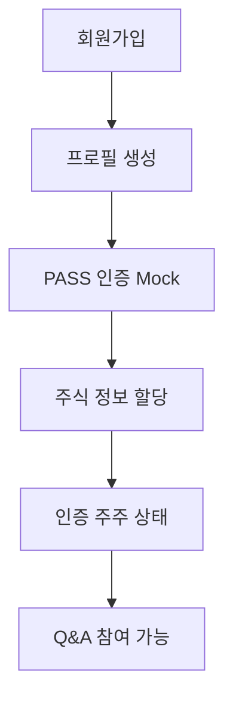
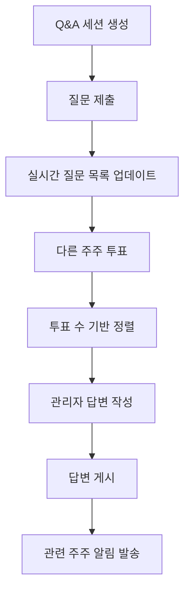
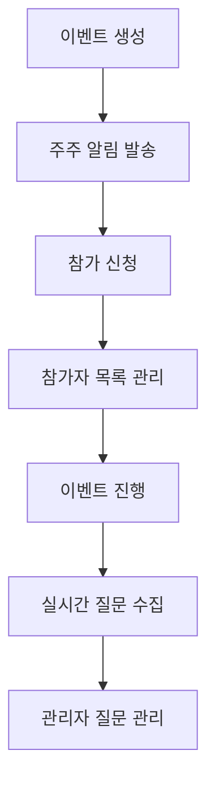

# IR-CSaaS MVP 설계 문서

## 개요

본 문서는 IR-CSaaS MVP의 백엔드 중심 시스템 설계를 정의합니다. Supabase를 백엔드 인프라로 활용하여 빠른 MVP 개발과 확장 가능한 아키텍처를 구현합니다.

## 아키텍처

### 전체 시스템 아키텍처

```
┌─────────────────┐    ┌──────────────────┐    ┌─────────────────┐
│   Next.js App   │────│   Supabase API   │────│   PostgreSQL    │
│   (Frontend)    │    │   (Backend)      │    │   (Database)    │
└─────────────────┘    └──────────────────┘    └─────────────────┘
         │                       │                       │
         │              ┌────────┴────────┐             │
         │              │                 │             │
         │              ▼                 ▼             │
         │    ┌─────────────────┐ ┌─────────────────┐   │
         │    │   Auth Service  │ │  Real-time      │   │
         │    │   (Supabase)    │ │  Subscriptions  │   │
         │    └─────────────────┘ └─────────────────┘   │
         │                                              │
         └──────────────────────────────────────────────┘
```

### 기술 스택

**Frontend:**
- Next.js 15 (App Router)
- TypeScript
- Tailwind CSS
- React Query (데이터 페칭)

**Backend:**
- Supabase (BaaS)
- PostgreSQL (데이터베이스)
- Row Level Security (RLS)
- Real-time Subscriptions

**인증:**
- Supabase Auth
- JWT 토큰
- Mock PASS 인증

## 컴포넌트 및 인터페이스

### 1. 데이터베이스 스키마

#### 1.1 사용자 관리 테이블

```sql
-- 사용자 프로필 (Supabase Auth 확장)
CREATE TABLE profiles (
  id UUID REFERENCES auth.users(id) PRIMARY KEY,
  email TEXT UNIQUE NOT NULL,
  name TEXT NOT NULL,
  phone TEXT,
  is_verified BOOLEAN DEFAULT FALSE,
  pass_verified_at TIMESTAMP,
  created_at TIMESTAMP DEFAULT NOW(),
  updated_at TIMESTAMP DEFAULT NOW()
);

-- 주식 보유 정보 (Mock 데이터)
CREATE TABLE user_stocks (
  id UUID DEFAULT gen_random_uuid() PRIMARY KEY,
  user_id UUID REFERENCES profiles(id) ON DELETE CASCADE,
  company_code TEXT NOT NULL, -- 기업 코드 (예: 005930)
  company_name TEXT NOT NULL, -- 기업명 (예: 삼성전자)
  shares_owned INTEGER NOT NULL DEFAULT 0,
  verified_at TIMESTAMP DEFAULT NOW(),
  created_at TIMESTAMP DEFAULT NOW()
);

-- 관리자 권한
CREATE TABLE admin_users (
  id UUID DEFAULT gen_random_uuid() PRIMARY KEY,
  user_id UUID REFERENCES profiles(id) ON DELETE CASCADE,
  company_code TEXT NOT NULL,
  role TEXT NOT NULL DEFAULT 'ir_manager', -- ir_manager, ir_admin, ceo
  created_at TIMESTAMP DEFAULT NOW()
);
```

#### 1.2 Q&A 시스템 테이블

```sql
-- Q&A 세션
CREATE TABLE qa_sessions (
  id UUID DEFAULT gen_random_uuid() PRIMARY KEY,
  company_code TEXT NOT NULL,
  title TEXT NOT NULL,
  description TEXT,
  status TEXT NOT NULL DEFAULT 'active', -- active, closed, scheduled
  start_date TIMESTAMP,
  end_date TIMESTAMP,
  created_by UUID REFERENCES profiles(id),
  created_at TIMESTAMP DEFAULT NOW(),
  updated_at TIMESTAMP DEFAULT NOW()
);

-- 질문
CREATE TABLE questions (
  id UUID DEFAULT gen_random_uuid() PRIMARY KEY,
  session_id UUID REFERENCES qa_sessions(id) ON DELETE CASCADE,
  user_id UUID REFERENCES profiles(id) ON DELETE CASCADE,
  content TEXT NOT NULL,
  status TEXT NOT NULL DEFAULT 'pending', -- pending, answered, rejected
  vote_count INTEGER DEFAULT 0,
  created_at TIMESTAMP DEFAULT NOW(),
  updated_at TIMESTAMP DEFAULT NOW()
);

-- 질문 투표
CREATE TABLE question_votes (
  id UUID DEFAULT gen_random_uuid() PRIMARY KEY,
  question_id UUID REFERENCES questions(id) ON DELETE CASCADE,
  user_id UUID REFERENCES profiles(id) ON DELETE CASCADE,
  vote_weight INTEGER NOT NULL, -- 보유 주식 수
  created_at TIMESTAMP DEFAULT NOW(),
  UNIQUE(question_id, user_id)
);

-- 답변
CREATE TABLE answers (
  id UUID DEFAULT gen_random_uuid() PRIMARY KEY,
  question_id UUID REFERENCES questions(id) ON DELETE CASCADE,
  admin_id UUID REFERENCES profiles(id),
  content TEXT NOT NULL,
  status TEXT NOT NULL DEFAULT 'draft', -- draft, published
  published_at TIMESTAMP,
  created_at TIMESTAMP DEFAULT NOW(),
  updated_at TIMESTAMP DEFAULT NOW()
);
```

#### 1.3 이벤트 관리 테이블

```sql
-- IR 이벤트
CREATE TABLE ir_events (
  id UUID DEFAULT gen_random_uuid() PRIMARY KEY,
  company_code TEXT NOT NULL,
  title TEXT NOT NULL,
  description TEXT,
  event_type TEXT NOT NULL, -- agm, earnings, presentation
  event_date TIMESTAMP NOT NULL,
  max_participants INTEGER,
  registration_required BOOLEAN DEFAULT TRUE,
  status TEXT NOT NULL DEFAULT 'scheduled', -- scheduled, ongoing, completed, cancelled
  meeting_url TEXT,
  created_by UUID REFERENCES profiles(id),
  created_at TIMESTAMP DEFAULT NOW(),
  updated_at TIMESTAMP DEFAULT NOW()
);

-- 이벤트 참가자
CREATE TABLE event_participants (
  id UUID DEFAULT gen_random_uuid() PRIMARY KEY,
  event_id UUID REFERENCES ir_events(id) ON DELETE CASCADE,
  user_id UUID REFERENCES profiles(id) ON DELETE CASCADE,
  registered_at TIMESTAMP DEFAULT NOW(),
  attended BOOLEAN DEFAULT FALSE,
  UNIQUE(event_id, user_id)
);

-- 이벤트 중 질문
CREATE TABLE event_questions (
  id UUID DEFAULT gen_random_uuid() PRIMARY KEY,
  event_id UUID REFERENCES ir_events(id) ON DELETE CASCADE,
  user_id UUID REFERENCES profiles(id) ON DELETE CASCADE,
  content TEXT NOT NULL,
  is_answered BOOLEAN DEFAULT FALSE,
  created_at TIMESTAMP DEFAULT NOW()
);
```

#### 1.4 알림 시스템 테이블

```sql
-- 알림
CREATE TABLE notifications (
  id UUID DEFAULT gen_random_uuid() PRIMARY KEY,
  user_id UUID REFERENCES profiles(id) ON DELETE CASCADE,
  type TEXT NOT NULL, -- question_answered, event_created, event_reminder
  title TEXT NOT NULL,
  message TEXT NOT NULL,
  data JSONB, -- 추가 데이터 (question_id, event_id 등)
  read BOOLEAN DEFAULT FALSE,
  created_at TIMESTAMP DEFAULT NOW()
);

-- 알림 설정
CREATE TABLE notification_settings (
  id UUID DEFAULT gen_random_uuid() PRIMARY KEY,
  user_id UUID REFERENCES profiles(id) ON DELETE CASCADE,
  email_notifications BOOLEAN DEFAULT TRUE,
  push_notifications BOOLEAN DEFAULT TRUE,
  question_answers BOOLEAN DEFAULT TRUE,
  event_notifications BOOLEAN DEFAULT TRUE,
  created_at TIMESTAMP DEFAULT NOW(),
  updated_at TIMESTAMP DEFAULT NOW(),
  UNIQUE(user_id)
);
```

### 2. API 설계

#### 2.1 인증 API

```typescript
// Mock PASS 인증
POST /api/auth/pass-verify
{
  "user_id": "uuid",
  "verification_code": "string" // Mock 랜덤 코드
}
Response: {
  "success": boolean,
  "verification_id": "string"
}

// Mock 주식 연동
POST /api/auth/stock-link
{
  "user_id": "uuid",
  "company_codes": ["005930", "000660"] // 선택적 기업 코드
}
Response: {
  "success": boolean,
  "stocks": [
    {
      "company_code": "005930",
      "company_name": "삼성전자",
      "shares_owned": 100
    }
  ]
}
```

#### 2.2 Q&A API

```typescript
// Q&A 세션 목록 조회
GET /api/qa/sessions?company_code=005930
Response: {
  "sessions": [
    {
      "id": "uuid",
      "title": "2024년 3분기 실적발표 Q&A",
      "status": "active",
      "question_count": 15,
      "start_date": "2024-01-15T10:00:00Z"
    }
  ]
}

// 질문 제출
POST /api/qa/questions
{
  "session_id": "uuid",
  "content": "올해 매출 전망은 어떻게 되나요?"
}

// 질문 투표
POST /api/qa/questions/:id/vote
{
  "vote_weight": 100 // 보유 주식 수
}

// 답변 작성 (관리자)
POST /api/qa/answers
{
  "question_id": "uuid",
  "content": "답변 내용",
  "status": "published"
}
```

#### 2.3 이벤트 API

```typescript
// 이벤트 생성 (관리자)
POST /api/events
{
  "title": "2024년 정기주주총회",
  "description": "연례 주주총회입니다",
  "event_type": "agm",
  "event_date": "2024-03-15T14:00:00Z",
  "max_participants": 500
}

// 이벤트 참가 신청
POST /api/events/:id/register
{
  "user_id": "uuid"
}

// 이벤트 중 질문 제출
POST /api/events/:id/questions
{
  "content": "배당 정책에 대해 질문드립니다"
}
```

### 3. 실시간 기능 설계

#### 3.1 Supabase Real-time 구독

```typescript
// Q&A 실시간 업데이트
const questionSubscription = supabase
  .channel('questions')
  .on('postgres_changes', {
    event: 'INSERT',
    schema: 'public',
    table: 'questions',
    filter: `session_id=eq.${sessionId}`
  }, (payload) => {
    // 새 질문 실시간 추가
    updateQuestionList(payload.new);
  })
  .on('postgres_changes', {
    event: 'UPDATE',
    schema: 'public',
    table: 'questions',
    filter: `session_id=eq.${sessionId}`
  }, (payload) => {
    // 투표 수 실시간 업데이트
    updateQuestionVotes(payload.new);
  })
  .subscribe();

// 알림 실시간 수신
const notificationSubscription = supabase
  .channel('notifications')
  .on('postgres_changes', {
    event: 'INSERT',
    schema: 'public',
    table: 'notifications',
    filter: `user_id=eq.${userId}`
  }, (payload) => {
    showNotification(payload.new);
  })
  .subscribe();
```

### 4. 보안 설계

#### 4.1 Row Level Security (RLS) 정책

```sql
-- 프로필 접근 제한
ALTER TABLE profiles ENABLE ROW LEVEL SECURITY;
CREATE POLICY "Users can view own profile" ON profiles
  FOR SELECT USING (auth.uid() = id);
CREATE POLICY "Users can update own profile" ON profiles
  FOR UPDATE USING (auth.uid() = id);

-- 질문 접근 제한
ALTER TABLE questions ENABLE ROW LEVEL SECURITY;
CREATE POLICY "Users can view questions in their company sessions" ON questions
  FOR SELECT USING (
    EXISTS (
      SELECT 1 FROM user_stocks us
      JOIN qa_sessions qs ON us.company_code = qs.company_code
      WHERE us.user_id = auth.uid() AND qs.id = session_id
    )
  );

-- 관리자만 답변 작성 가능
ALTER TABLE answers ENABLE ROW LEVEL SECURITY;
CREATE POLICY "Only admins can manage answers" ON answers
  FOR ALL USING (
    EXISTS (
      SELECT 1 FROM admin_users au
      WHERE au.user_id = auth.uid()
    )
  );
```

#### 4.2 JWT 토큰 검증

```typescript
// 미들웨어에서 토큰 검증
export async function middleware(request: NextRequest) {
  const token = request.cookies.get('supabase-auth-token');
  
  if (!token) {
    return NextResponse.redirect(new URL('/login', request.url));
  }
  
  const { data: { user }, error } = await supabase.auth.getUser(token.value);
  
  if (error || !user) {
    return NextResponse.redirect(new URL('/login', request.url));
  }
  
  // 관리자 페이지 접근 제한
  if (request.nextUrl.pathname.startsWith('/admin')) {
    const { data: adminUser } = await supabase
      .from('admin_users')
      .select('*')
      .eq('user_id', user.id)
      .single();
      
    if (!adminUser) {
      return NextResponse.redirect(new URL('/unauthorized', request.url));
    }
  }
  
  return NextResponse.next();
}
```

## 데이터 모델

### 1. 사용자 데이터 흐름



### 2. Q&A 데이터 흐름



### 3. 이벤트 데이터 흐름



## 에러 처리

### 1. API 에러 응답 형식

```typescript
interface ApiError {
  error: {
    code: string;
    message: string;
    details?: any;
  };
  timestamp: string;
  path: string;
}

// 예시 에러 응답
{
  "error": {
    "code": "UNAUTHORIZED",
    "message": "인증되지 않은 사용자입니다",
    "details": {
      "required_auth": "verified_shareholder"
    }
  },
  "timestamp": "2024-01-15T10:30:00Z",
  "path": "/api/qa/questions"
}
```

### 2. 클라이언트 에러 처리

```typescript
// React Query를 활용한 에러 처리
const { data, error, isLoading } = useQuery({
  queryKey: ['questions', sessionId],
  queryFn: () => fetchQuestions(sessionId),
  onError: (error: ApiError) => {
    switch (error.error.code) {
      case 'UNAUTHORIZED':
        router.push('/login');
        break;
      case 'FORBIDDEN':
        toast.error('접근 권한이 없습니다');
        break;
      default:
        toast.error('오류가 발생했습니다');
    }
  }
});
```

## 테스팅 전략

### 1. 단위 테스트
- API 엔드포인트 테스트
- 데이터베이스 함수 테스트
- 비즈니스 로직 테스트

### 2. 통합 테스트
- 인증 플로우 테스트
- Q&A 전체 워크플로우 테스트
- 실시간 기능 테스트

### 3. E2E 테스트
- 사용자 회원가입부터 질문 제출까지
- 관리자 답변 작성 플로우
- 이벤트 생성 및 참여 플로우

이 설계는 MVP의 핵심 기능을 빠르게 구현하면서도 향후 확장 가능한 구조를 제공합니다.